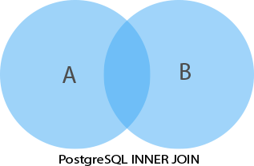

### SQL

##### Instructor Notes
- <u>Structured Query Language</u> ("SQL"): standard language for communicating with a relational database
- Every relational database system has its own flavor of SQL it implements
- <u>dialect</u>: flavor of database implementation unique to the database management system

| Manipulating data | Querying Data | Structuring Data | Joins & Groupings |
| --- | --- | --- | --- |
| INSERT | SELECT | CREATE TABLE | (INNER) JOIN, LEFT JOIN, RIGHT JOIN |
| UPDATE |  | ALTER TABLE | GROUP BY |
| DELETE |  | DROP TABLE | SUM |
|  |  | ADD COLUMN | COUNT |
|  |  | DROP COLUMN |  |

#### SQL Review
You should feel familiar and comfortable understanding what each command below does to a relational database.

Click on any of the commands to check out the Postgres tutorial page on how that command works.

Detailed information in the [SQL Review Document](020204_SQL_Review.md)

##### Manipulating Data
- [INSERT](http://www.postgresqltutorial.com/postgresql-insert/):

        INSERT INTO table(column1, column2, ...)
        VALUES (value1, value2,...);

- [UPDATE](http://www.postgresqltutorial.com/postgresql-update/):

        UPDATE table
        SET column1 = value1
            column2 = value2 , ...
        WHERE condition

- [DELETE](http://www.postgresqltutorial.com/postgresql-delete/):

        DELETE from table
        WHERE condition;

##### Querying Data
- [SELECT](http://www.postgresqltutorial.com/postgresql-select/):

      SELECT
        column_1,
        column_2,
        ...
      FROM
        table_name;
- `SELECT` has the following clauses: `DISTINCT`, `ORDER BY`, `WHERE`, `LIMIT`, `FETCH`, `GROUP BY`, `HAVING`, `INNER JOIN`, `LEFT JOIN`, `FULL OUTER JOIN`, `CROSS JOIN`, `UNION`, `INTERSECT`, `EXCEPT`. See [Select Clauses Review](020204_select_clauses.md) for more information on all of them.

##### Structuring Data
- [CREATE TABLE](http://www.postgresqltutorial.com/postgresql-create-table/)

      CREATE TABLE table_name (
        column_name TYPE column_constraint,
        table_constraint, table constraint
      ) INHERITS existing_table_name

- [ALTER TABLE](http://www.postgresqltutorial.com/postgresql-alter-table/)

      ALTER TABLE table_name action;

- [DROP TABLE](http://www.postgresqltutorial.com/postgresql-drop-table/)

      DROP TABLE [IF EXISTS] table_name [CASCADE | RESTRICT];

- [ADD TABLE](http://www.postgresqltutorial.com/postgresql-add-column/)

      ALTER TABLE table_name
      ADD COLUMN new_column_name data_type;

- [DROP COLUMN](http://www.postgresqltutorial.com/postgresql-drop-column/)

      ALTER TABLE table_name
      DROP COLUMN column_name;

##### Joins and Groupings
- [INNER JOIN, OUTER JOINS](http://www.postgresqltutorial.com/postgresql-joins/)

| INNER JOIN | LEFT JOIN | FULL OUTER JOIN |
| --- | --- | --- |
|  |  |  |

  - `INNER JOIN`

        SELECT
          A.pka,
          A.c1,
          B.pkb,
          B.c2
        FROM
          A
        INNER JOIN B on A.pka = B.fka;

  - `LEFT JOIN`

        SELECT
          A.pka,
          A.c1,
          A.pkb,
          B.c2
        FROM
          A
        LEFT JOIN B ON A .pka = B.

  - `FULL OUTER JOIN`

        SELECT * FROM A
        FULL [OUTER] JOIN B on A.id = B.id

- [GROUP BY, SUM, COUNT](http://www.postgresqltutorial.com/postgresql-group-by/)

          SELECT column_1, aggregate_function(column_2)
          FROM tbl_name
          GROUP BY column_1;
