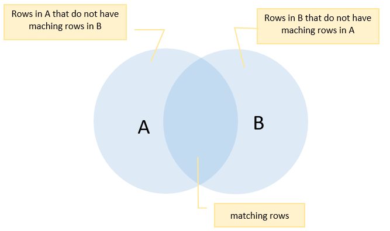

# Select Clauses
The [SELECT](http://www.postgresqltutorial.com/postgresql-select/) statement has the following clauses:

| Clause | Usage | Section | Documentation Link |
| --- | --- | --- | --- |
| DISTINCT | Remove Duplicate Rows |  |  |
| ORDER BY | Sort Rows |  |  |
| WHERE | Filter Rows |  |  |
| LIMIT | Select a Subset of Rows |  |  |
| FETCH | Select a Subset of Rows |  |  |
| GROUP BY | Group Rows |  |  |
| HAVING | Filter Groups |  |  |
| INNER JOIN | Join with Other Tables |  |  |
| LEFT JOIN | Join with Other Tables |  |  |
| RIGHT JOIN | Join with Other Tables |  |  |
| OUTER JOIN | Join with Other Tables |  |  |
| CROSS JOIN | Join with Other Tables |  |  |
| UNION | combines SELECT statements |  |  |
| INTERSECT | returns rows common to SELECT statements |  |  |
| EXCEPT | returns distinct rows returned by one SELECT statement but not the other |  |  |

### DISTINCT
Select distinct rows using [DISTINCT](http://www.postgresqltutorial.com/postgresql-select-distinct/) operator.
- used to remove duplicate rows from a result set
- keeps one row for each group of duplicates
- can be used on one or more columns of a table
- notice that the `DISTINCT ON` expression must match the leftmost expression in the `ORDER BY` clause

- DISTINCT syntax:

      SELECT
        DISTINCT column_1
      FROM
        table_name;

- DISTINCT syntax for multiple columns:

      SELECT
        DISTINCT column_1, column_2
      FROM
        table_name;

- DISTINCT syntax using `DISTINCT ON (expression)`:
  - keeps the "first" row of each group of duplicates using the following syntax

        SELECT
          DISTINCT ON (column_1) column_alias,
          column_2
        FROM
          table_name
        ORDER BY
          column_1,
          column_2;

  - The order of rows returned from the `SELECT` statement is unpredictable therefore the first row of each group of the duplicate is also unpredictable
  - It is good practice to always use the `ORDER BY` clause with the `DISTINCT ON (expression)` to make the result set obvious

### Order By
Sort rows using [ORDER BY](http://www.postgresqltutorial.com/postgresql-order-by/) clause in ascending or descending order based on specified criteria.
  - `ORDER BY` syntax:

        SELECT
          column_1,
          column_2
        FROM
          tbl_name
        ORDER BY
          column_1 ASC,
          column_2 DESC;

  1. Specify the column that you want to sort in the `ORDER BY` clause. If you sort the result set based on multiple columns, use a comma to separate between two columns.
  2. Use `ASC` to sort the result set in ascending order and `DESC` to sort the result set in descending order. If you leave it blank, the `ORDER BY` clause will use `ASC` by default.
  - Related Tutorials: [Postgre SQL LIMIT](http://www.postgresqltutorial.com/postgresql-limit/)

### Where
Filter rows using [WHERE](http://www.postgresqltutorial.com/postgresql-where/) clause.
- `WHERE`Syntax:

      SELECT select_list
      FROM table_name
      WHERE condition;

- The `WHERE` clause appears right after the `FROM` clause of the `SELECT` statement.  The `WHERE` clause uses the condition to filter the rows returned from the `SELECT` statement.
- The `condition` must evaluate to true, false, or unknown. It can be a Boolean expression or a combination of Boolean expressions using `AND` and `OR` operators.
- The query returns the rows that satisfy the `condition` in the `WHERE` clause. In other words, only rows that cause the condition evaluates to true will be included in the result set.
- Besides the `SELECT` statement, you can use the `WHERE` clause in the [`UPDATE`](http://www.postgresqltutorial.com/postgresql-update/) and [`DELETE`](http://www.postgresqltutorial.com/postgresql-delete/) statement to specify rows to be updated or deleted.

#### Logical Operators used with `WHERE`:
| Operator | Description |
| --- | --- |
| = | Equal |
| > | Greater than |
| < | Less than |
| >= | Greater than or equal |
| <= | Less than or equal |
| <> or != | Not equal |
| AND | Logical Operator AND |
| OR | Logical Operator OR |

## Selecting a Subset of Rows
- Select a subset of rows from a table using [LIMIT](http://www.postgresqltutorial.com/postgresql-limit/) or [FETCH](http://www.postgresqltutorial.com/postgresql-fetch/) clause.

### LIMIT
- `LIMIT` Syntax:

      SELECT
        *
      FROM
        table_name
      LIMIT n;

  - Statement returns `n` rows generated by the query.
    - if `n` is zero, the query returns an empty set
    - if `n` is `NULL`, the query returns the same result set as omitting the `LIMIT` clause
- `LIMIT` Syntax to skip a number of rows before returning the `n` rows, you use `OFFSET` clause placed after the `LIMIT` cause as the following statement:

      SELECT
        *
      FROM
        table
      LIMIT n OFFSET m;

  - The statement first skips `m` rows before returning `n` rows generated by the query.
  - If `m` is zero, the statement will work like without the `OFFSET` clause
  - Order of the rows in the database is unspecified; use `LIMIT` clause with the [`ORDER BY`](http://www.postgresqltutorial.com/postgresql-order-by/) clause

### FETCH
- `FETCH` Syntax:

      OFFSET start { ROW | ROWS }
      FETCH { FIRST | NEXT } [ row_count ] { ROW | ROWS } ONLY

  - `ROW` and `FIRST` are synonymous with `ROWS` and `NEXT` repectively
  - the `START` is an integer that must be zero or positive
    - by default, it is zero if the `OFFSET` clause is not specified.
    - In case the `start` is greater than the number of rows in the underlying result set, no rows are returned
  - The `row_count` is one or higher.
    - by default, the value of `row_count` is one if it is not specified

### GROUP BY
- Group rows into groups using [GROUP BY](http://www.postgresqltutorial.com/postgresql-group-by/) clause
  - divides the rows returned from the `SELECT` statement into groups
  - you can apply an aggregate function (ex. `SUM()` to calculate the sum of the items or `COUNT()` to get the number of items in groups)
  - must appear right after the `FROM` or `WHERE` clause

- `GROUP BY` syntax:

        SELECT column_1, aggregate_function(column_2)
        FROM tbl_name
        GROUP BY column_1;

### HAVING
- Filter groups using [HAVING](http://www.postgresqltutorial.com/postgresql-having/) clause.
  - `HAVING` Syntax:

        SELECT
          column_1,
          aggregate_function (column_2)
        FROM
          tbl_name
        GROUP BY
          column_1
        HAVING
          condition;

    - The `HAVING` clause sets the condition for group rows created by the `GROUP BY` clause after the `GROUP BY` clause applies; this is the main difference between `HAVING` and `WHERE` clauses
    - Using the `HAVING` clause without the `GROUP BY` clause will turn the query into a single group.
      - The `SELECT` list and `HAVING` clause can only refer to columns from within aggregate functions
      - This kind of query returns a single row if the condition in the `HAVING` clause is true or zero row if it is false

## JOINS
- Join with other tables using joins such as
  - [INNER JOIN](http://www.postgresqltutorial.com/postgresql-inner-join/)
  - [LEFT JOIN](http://www.postgresqltutorial.com/postgresql-left-join/)
  - [FULL OUTER JOIN](http://www.postgresqltutorial.com/postgresql-full-outer-join/)
  - [CROSS JOIN](http://www.postgresqltutorial.com/postgresql-cross-join/) clauses

### INNER JOIN
the [`INNER JOIN`](http://www.postgresqltutorial.com/postgresql-inner-join/) clause returns rows in A table that have the corresponding rows in B table

- `INNER JOIN` syntax

      SELECT
        A.pka,
        A.c1,
        B.pkb,
        B.c2
      FROM
        A
      INNER JOIN B on A.pka = B.fka;

  1. Specify the column in both tables from which you want to select data in the `SELECT` clause
  2. Specify the main table (i.e. `A`) in the `FROM` clause
  3. Specify the table that the main table joins to (i.e. `B`) in the `INNER JOIN` clause. In addition, you put a join condition after the `ON` keyword (i.e. `A.pka = B.fka`)

### LEFT JOIN
the [LEFT JOIN](http://www.postgresqltutorial.com/postgresql-left-join/) clause returns rows in the `A` (left) table that has corresponding rows in the `B` (right) table
  - also referred to as `LEFT OUTER JOIN`

  - `LEFT JOIN` syntax

        SELECT
          A.pka,
          A.c1,
          A.pkb,
          B.c2
        FROM
          A
        LEFT JOIN B ON A .pka = B.
  - You can add a `WHERE` clause to select only films that are not in the inventory using a left join:

        SELECT
          film.film_id,
          film.title,
          inventory_id
        FROM
          film
        LEFT JOIN inventory ON inventory.film_id = film.film_id
        WHERE
          inventory.film_id IS NULL;

### FULL OUTER JOIN
the [FULL OUTER JOIN](http://www.postgresqltutorial.com/postgresql-full-outer-join/) combines the results of both left join and right join.

  - The result includes the matching rows from the both tables, and also the rows that do not match.
  - `RIGHT JOIN` syntax

        SELECT * FROM A
        FULL [OUTER] JOIN B on A.id = B.id

    - the `OUTER` keyword is optional
  - If the rows in the joined table do not match, the full outer join sets NULL values for every column of the table that lacks a matching row.
  - For the matching rows, a single row is included in the result set that contains columns populated from both joined tables.

### CROSS JOIN
the [CROSS JOIN](http://www.postgresqltutorial.com/postgresql-cross-join/) allows you to produce the cartesian product of rows in two or more tables
  - <u>Cartesian Product</u>: the product of two sets: the product of set X and set Y is the set that contains all ordered pairs ( x, y ) for which x belongs to X and y belongs to Y.
  - For every row from T1 and T2 in a `CROSS JOIN` of tables T1 and T2, the cartesian product or result set will contain a row that consists of all columns in the T1 table followed by all columns in the T2 table
  - The `CROSS JOIN` does not have any matching condition in the join clause

  - `CROSS JOIN` syntax

        SELECT *
        FROM T1
        CROSS JOIN T2;

  - Equivalent statement:

        SELECT *
        FROM T1, T2;

  - You can use the INNER JOIN clause with the condition evaluates to true to perform the cross join as follows:

        SELECT *
        FROM T1
        INNER JOIN T2 ON TRUE;

## Set Operations
- Perform set operations using [UNION](http://www.postgresqltutorial.com/postgresql-union/), [INTERSECT](http://www.postgresqltutorial.com/postgresql-intersect/), and [EXCEPT](http://www.postgresqltutorial.com/postgresql-tutorial/postgresql-except/).

### UNION
the [`UNION` operator](http://www.postgresqltutorial.com/postgresql-union/) combines result sets of two or more `SELECT` statements into a single result set
- `UNION` operator syntax:

      SELECT
        column_1,
        column_2
      FROM
        tbl_name_1
      UNION
      SELECT
        column_1,
        column_2
      FROM
        tbl_name_2;

  - Both queries must return the same number of columns
  - The corresponding columns in the queries must have compatible data types
- The `UNION` operator may place the rows in the first query before, after or between the rows in the result set of the second query. To sort the rows in the combined result set by a specified column, you use the ORDER BY clause.

### INTERSECT
the [`INTERSECT` clause](http://www.postgresqltutorial.com/postgresql-intersect/) combines the result sets of two or more `SELECT` statements into a single result set containing any rows that are available in both result set or returned by both queries

- `INTERSECT` operator example:

        SELECT
          column-list
        FROM
          A
        INTERSECT
        SELECT
          column-list
        FROM
          B;

  - The number of columns and their order in the `SELECT` clauses must be the same
  - The data types of the columns must be compatible
- To sort the result set returned by the `INTERSECT` operator, you place the `ORDER BY` clause at the end of the statement, not at the end of each `SELECT` statement.

### EXCEPT
the [`EXCEPT` clause](http://www.postgresqltutorial.com/postgresql-tutorial/postgresql-except/) returns distinct rows from the first (left) query that are not in the output of the second (right) query.
- `EXCEPT` operator syntax:

      SELECT column_list
      FROM A
      WHERE condition_a
      EXCEPT
      SELECT column_list
      FROM B
      WHERE condition_b;
  - The number of columns and their orders must be the same in the two queries
  - The data types of the respective columns must be compatible
- The following Venn diagram illustrates the result of the of `EXCEPT` operator that apply to the A and B tables.
  
- You must place the `ORDER BY` clause at the end of the statement to sort the output of a select statement using the `EXCEPT` operator; if it is placed in each query, the final result may not be sorted:

      SELECT column_list
      FROM A
      WHERE condition_a
      EXCEPT
        SELECT column_list
        FROM B
        WHERE condition_b
      ORDER BY column;
